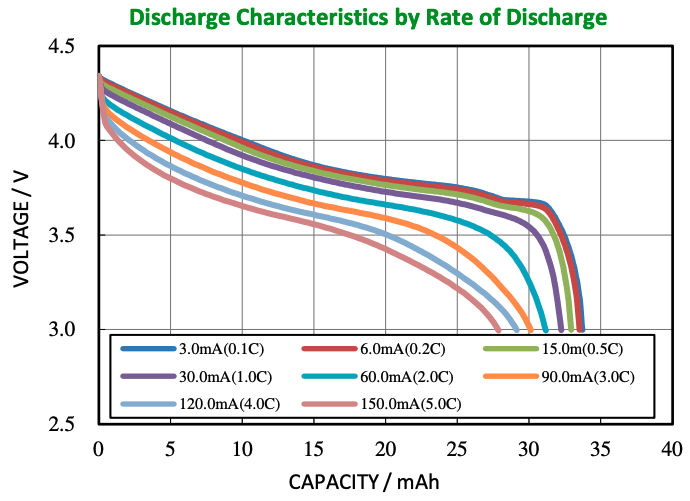
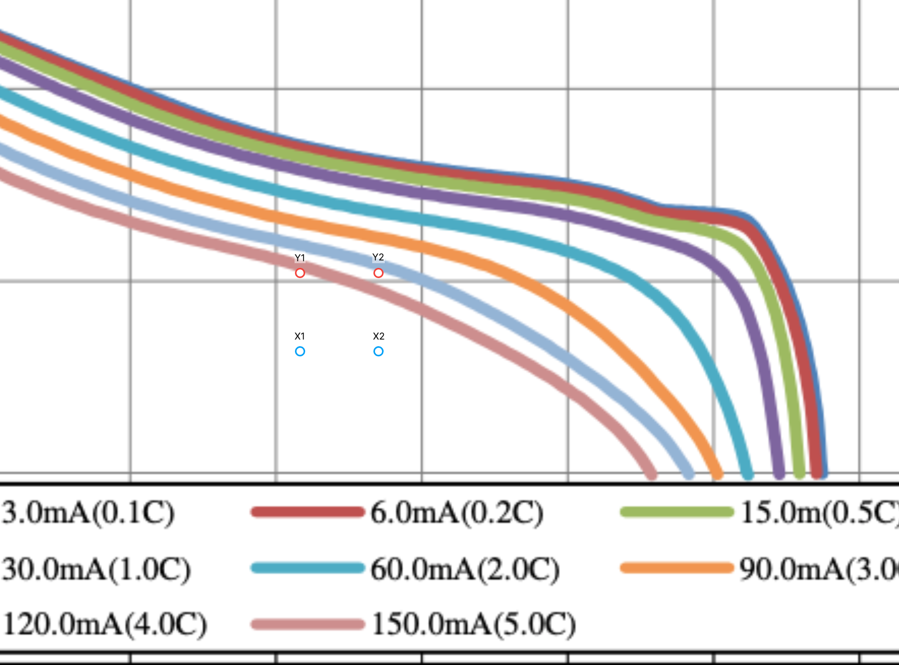
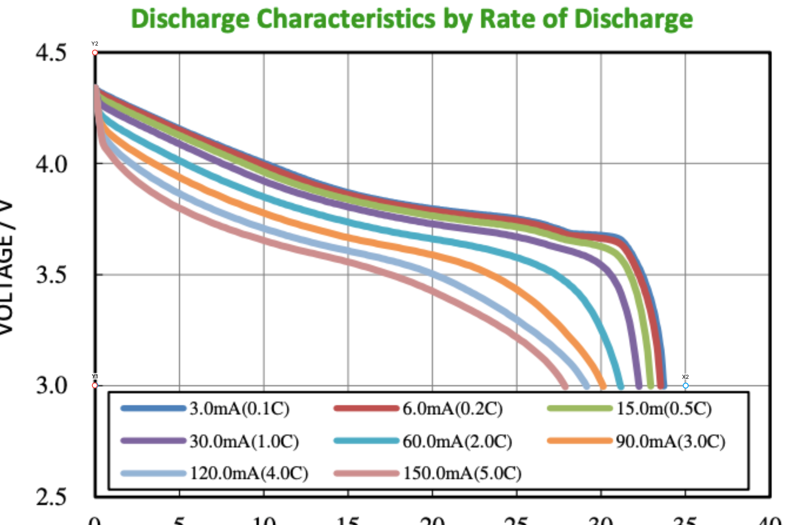
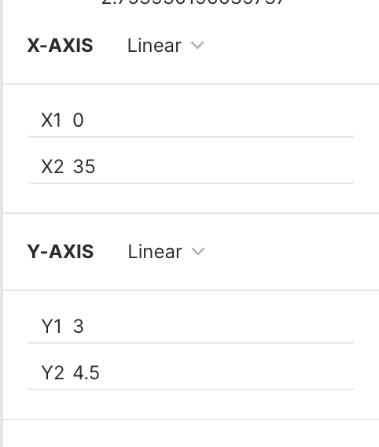

# Digipyze

This repository contains a python script used to digitalize a battery curve and to extract the parameters to insert in [MESSY](https://github.com/eml-eda/messy).

## Preparing the virtual environment

Since we are dealing with some external python libraries, we need to prepare a virtual environment and install all the needed libraries. To do that just enter in the folder where you clone this repository and run:

```bash
python3 -m venv venv
```

Then you need to activate it by running:

```bash
source venv/bin/activate
```

Now you can install all the packages contained in the requirements.txt file by running:

```bash
pip3 -r install rquirements.txt
```

Everything now should be ready and you can move on to the next step!

## Using PlotDigitalizer


First of all, we need to digitalize al least TWO of the curve from the datasheet. It is important to use the discharge characteristics, which is a Voltage vs Capacity plot, like the following



To do that, we use an online Tool, called [PlotDigitizer](https://plotdigitizer.com/). When you open the website and launch the app, you will be promped to upload an image. 
When the image is uploaded, you should find 4 points, labelled as *x1*, *x2*, *y1* and *y2*. This are used to calibrate the measurments. 



Now move the 4 points in meaningful parts of the graph, as shown in the following pictures. As you can see, we moved *x1* and *y1* in the point (0, 3), while *x2* is in (35, 3) and *y2* is in (0, 4.5). 

> [!NOTE]
> If you don't clearly see *x1* and *y1* is because they are one on top of the other in the point (0, 3)


In the top right of the screen you should see a window where you can enter the value of the points. 



Just enter the values of the points, so that the system is calibrated



Now, if you click in any part of the plot, you should see a white point appearing. This means that a point has been captured and you should see a list of point on the top left of the screen. You can now select a curve, for example 1C, and select some white point to follow the curve. 

> [!NOTE]
> You can select as much point you want, the more the better. However, selecting around 15-20 points should be a reasonable value and will allow to obtain good accuracy.

When you are happy with the selected number of points, just click the *copy button* on the top left to select all the points. Paste the output into a .txt file, which will be the file containing the points of your first curve. 

Now repeat the procedure for another curve, different from the one already digitalized.

> [!WARNING]
> The tool allows to digitalize one line at a time. To digitalize the other one, just repeat the process from scratch, calibrate, select some points and then paste them into another .txt.


## How to run it

Now you should have two .txt files, where you have the points of the two curves. The files should look something like this:

```txt
x, y
0.03410000,  3.00830000
0.04210000,  3.04570000
0.07820000,  3.14540000
0.09820000,  3.19110000
0.14030000,  3.26180000
0.20040000,  3.35320000
0.24450000,  3.41140000
0.30460000,  3.48610000
0.33670000,  3.51520000
0.39280000,  3.56090000
0.47700000,  3.60660000
0.55510000,  3.64400000
0.63730000,  3.70220000
0.70940000,  3.75620000
0.79360000,  3.83100000
0.83970000,  3.88500000
0.89780000,  3.95980000
0.93790000,  4.03460000
0.97190000,  4.09700000
0.98800000,  4.17590000
0.99600000,  4.23820000
```
In the folder `curves` you find two examples of two .txt files extracted by the characteristic showed before. 

Now that everything is ready, you can run the python script passing the correct command line arguments to compute the parameters of polynomial.

The command line arguments are the following:

| Name              | Type   | Description                       |
|-------------------|--------|-----------------------------------|
| first-curve-file  | String | Path to the first curve .txt file |
| second-curve-file | String | Path to the first curve .txt file |
| battery-capacity  | Int    | Capacity of the battery in mAh    |


> [!WARNING]
> The capacity of the battery MUST be in mAh

```bash
python3 prova.py --first-curve-file first_curve_filename.txt --second-curve-file second_curve_filename.txt --battery-capacity battery_capacity_in_mAh
```

